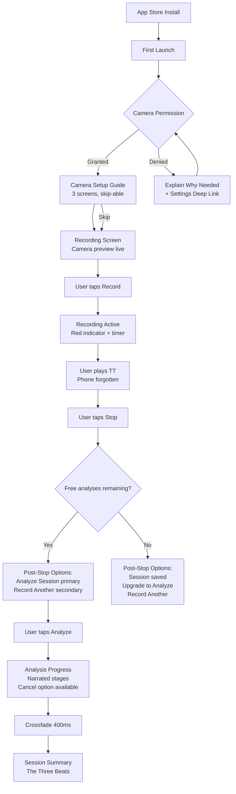
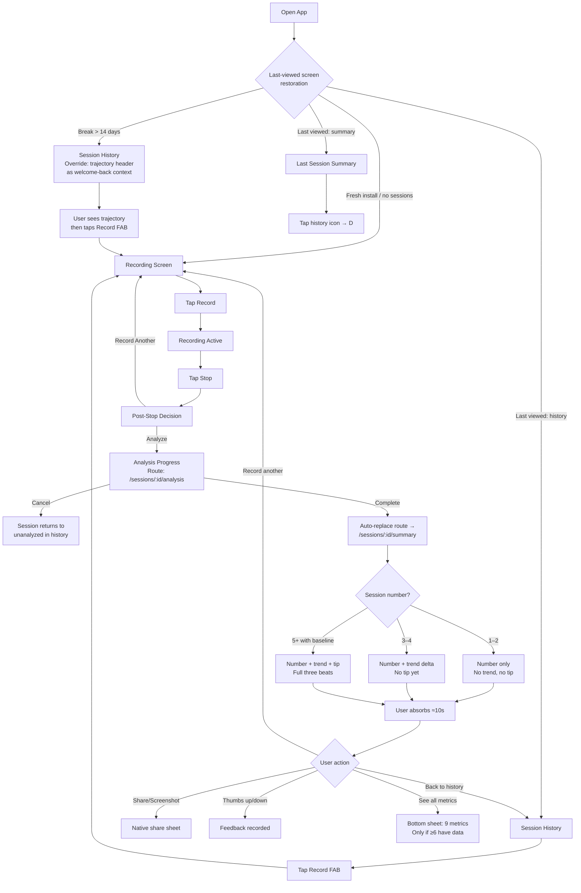

# UX Design Specification pingpongbuddy

**Author:** Fam
**Date:** 2026-04-05

---

## Executive Summary

### Project Vision

PingPongBuddy is a "quiet coach" mobile app that uses on-device pose estimation and ball detection to analyze table tennis body mechanics post-session. The app optimizes for zero screen time during play — set phone on tripod, press record, play, review later. The product succeeds when the player puts the phone down and plays better.

The UX north star is defined by the Design Philosophy: "The Quiet Coach" — watches quietly, notices one thing, tells you simply, lets you go try it. Every screen, every interaction, every word of copy should feel like a coach's notebook, not a data dashboard.

### Target Users

**Primary persona — Marcus:** Aspiring competitor, 20-40 years old, plays 2-4x/week at a club, 1-3 years experience, no regular coaching access. Tech-savvy enough to use a phone on a tripod but not interested in fiddling with settings or interpreting data dashboards. Willing to pay $5-15/month for a tool that demonstrably helps. Key emotional state: curious about his own game but has never had numbers for it.

**Secondary personas:**
- **Priya:** Plays at a community center with inconsistent lighting and packed tables. Represents the degraded-conditions user.
- **Returning Marcus:** 3-week break, rusty muscle memory, needs re-orientation without guilt.

### Key Design Challenges

**1. The "one insight" constraint — complete without being sparse.**
The session summary must feel complete with minimal information (stroke counts, on-table rates, one observation/tip). If the screen feels empty, users think the app isn't doing enough. If it's too dense, it violates "one tip, plain English." The balance between "enough to be valuable" and "not a dashboard" is the hardest UX problem.

**2. Trust ladder invisibility — earned, not withheld.**
The app silently transitions from observation-only (sessions 1-4) to coaching tips (session 5+). Early sessions must feel complete, not limited. The baseline progress indicator bridges this gap with neutral, factual language — not personality text. The coach voice is reserved for the insight slot, where it has something worth saying.

**3. Degradation messaging without losing trust.**
When conditions are bad, the message must be honest without making the user feel the app is unreliable. The tone is "we're being careful with your data" not "something went wrong." The degradation note is always a footnote — never the primary insight.

**4. Intentional minimalism — chosen, not incomplete.**
SwingVision's biggest UX complaint is information overload. PingPongBuddy's restraint is a competitive advantage. But "intentionally minimal" and "under-built" feel different to the user. Visual polish is the signal of intentionality — a beautifully designed single-number display says "we chose this." A plain-text number says "we haven't finished yet."

### Design Opportunities

**1. The screenshot moment as viral acquisition.**
Session summary designed for native sharing — "Bro, my backhand is literally a coin flip." Clean, bold hero metric that looks good cropped as a text message screenshot. The top half of the session summary is a self-contained shareable artifact. This is free marketing.

**2. The trust ladder as emotional design.**
The transition from "here are your numbers" to "here's what to work on" can feel like the app is growing alongside the player. The coach speaks for the first time when it has earned the right — a subtle, loyalty-building moment.

**3. The upgrade screen as a mirror, not a gate.**
Show the player's own improvement trajectory and past coaching insights — real data they earned through practice. "In your last 8 sessions, you received 3 coaching insights that helped your on-table rate climb from 58% to 67%." No teased future insight (Commandment 6 — honest or silent). The mirror is the conversion mechanism.

**4. Delta indicator for returning users.**
Session 1 hero metric is the raw number ("58%"). By session 10 the raw number alone isn't surprising — the change is. "67% ↑ from 58%" makes session 10 as emotionally engaging as session 1. Small implementation cost (delta from baseline mean), big retention impact.

### Session Summary Visual Hierarchy

The session summary is the most important screen in the app. Three-tier layout with strict information hierarchy:

```
┌─────────────────────────────────────┐
│                                     │
│              58%                    │  ← Hero: Session on-table rate
│         on-table rate               │     (huge, bold, impossible to miss)
│          ↑ from 52%                 │     (delta shown after baseline exists)
│                                     │
├─────────────────────────────────────┤
│  Forehand topspin    Backhand       │  ← Supporting: Per-type breakdown
│  47 strokes · 62%   31 strokes·49% │     (scannable, secondary size)
│                                     │
│  Other: 26 strokes                  │
├─────────────────────────────────────┤
│                                     │
│  "Your forehand topspin was your    │  ← Insight: The coach speaks
│   most consistent stroke at 62%     │     (one observation or tip — never
│   on-table. Your backhand landed    │      more, never a disclaimer)
│   less than half the time."         │
│                              👍 👎  │  ← Feedback: subtle, inline, optional
│                                     │
├─────────────────────────────────────┤
│  [Watch Video]  [Share]             │  ← Actions: secondary chrome
│                                     │
│  ⚠️ Limited visibility this session │  ← Degradation: footnote only
│     Observations based on 70% of    │     (never occupies insight slot)
│     detected strokes                │
└─────────────────────────────────────┘
```

**Hierarchy rules:**
- The hero metric is the screenshot crop — top half is a self-contained shareable artifact
- The insight slot is sacred — always the coach speaking (observation or tip), never wasted on a disclaimer
- Degradation is a footnote below actions — honest but not prominent
- If a session is too degraded for any meaningful observation, the insight slot shows an adaptive setup tip (FR11), not a disclaimer
- Baseline progress ("37/100 forehand topspins — building your baseline") replaces the insight slot in pre-trust-ladder sessions — neutral, factual language
- The coach voice lives in the insight slot only — no personality text in progress indicators or supporting metrics

### UX Voice Rules

**The coach speaks only in the insight slot.** All other text is neutral and factual. This preserves the weight of the moment when the coach actually has something to say.

| Screen Area | Voice | Example |
|-------------|-------|---------|
| Hero metric | Neutral/data | "58% on-table rate" |
| Supporting metrics | Neutral/data | "47 forehand topspins · 62%" |
| Insight (observation) | Coach voice | "Your forehand topspin was your most consistent stroke this session." |
| Insight (coaching tip) | Coach voice | "Your shoulder rotation has been climbing — and your on-table rate is climbing with it. Keep it going." |
| Baseline progress | Neutral/factual | "37/100 forehand topspins — building your baseline" |
| Degradation note | Neutral/honest | "Observations based on 70% of detected strokes" |
| Setup guidance | Helpful/practical | "Most club players set their phone at the side of the table — your partner won't notice after the first point." |

### Onboarding: Normalizing the Tripod

The camera setup guide (FR8) addresses technical positioning (height, distance, angle). But the social friction of having a phone on a tripod at a club is an unaddressed adoption barrier. Onboarding should include a brief, authentic normalization moment — not marketing-speak, just reassurance:

"Most players set up at the side of the table, about 3 meters back. It takes 30 seconds and your partner won't even notice after the first rally."

This acknowledges the real-world club context where 5+ tables are going simultaneously and self-consciousness is natural.

### Deferred UX Decisions (Post-MVP)

| Decision | Rationale for Deferral |
|----------|----------------------|
| Adaptive hero metric (per-player most relevant metric) | Requires enough session data to determine which metric is most coaching-relevant. MVP fixed at on-table rate. |
| Pre-recording confidence indicator (record button color shift) | Adds MediaPipe startup cost to recording flow, risks NFR7 (3-second recording-ready). Reactive guidance in session summary is sufficient for MVP. |
| Stroke-linked video playback (jump to specific moments) | Requires frame-level indexing and additional UI complexity. Basic play/pause/scrub is MVP. |

## Core User Experience

### Defining Experience

The core product loop is: **tap Record → play → tap Stop → tap Analyze → see your number.** Five interactions. If this loop feels effortless and the number at the end is surprising or valuable, everything else follows. The session summary is the reward; the recording is the cost. The cost must be near-zero.

The app has a passive-capture interaction model — it does its hardest work when the user isn't looking at it. Recording is passive (phone on tripod). Analysis is passive (background processing). The only *active* moment is reading the session summary. That's the one screen where the user gives the app their full attention.

### Platform Strategy

- **Cross-platform mobile** (Flutter): Android + iOS from day one. No desktop, no web.
- **Touch-only interaction model.** All interactions are tap or swipe. No text input anywhere in MVP (no search, no manual entry, no typing).
- **Offline-first architecture:** All functionality works without internet. Network required only for subscription purchase/validation and app updates.
- **Device capabilities leveraged:** Camera (recording), GPU/NPU (MediaPipe inference), local notifications (analysis complete), native share sheet (session summary sharing).

**iOS background analysis limitation:** iOS aggressively suspends background tasks via `BGTaskScheduler` — the computation isolate may pause after ~30 seconds when the app is fully backgrounded. Two scenarios:

| Scenario | Behavior | UX Implication |
|----------|----------|----------------|
| App stays in foreground or brief background | Analysis completes, push notification fires | Happy path — "walk away and get notified" works |
| App fully backgrounded >30s (iOS) | Analysis pauses, resumes when app reopened | Progress screen auto-resumes on foreground — no action required from user |

On Android, background analysis generally completes without suspension. The UX spec documents this difference so implementation doesn't promise what iOS can't deliver. The user experience is still "zero effort" — the user doesn't need to do anything special on either platform.

**Notification permission timing:** Requested after the first analysis starts (not at app launch, not during onboarding). Contextual framing: "Want to know when your session summary is ready?" This is the moment the user understands *why* notifications are valuable. iOS requires explicit permission dialog; Android 13+ does too; Android 12 and below grants automatically.

### Effortless Interactions

| Interaction | Target Effort | How |
|-------------|--------------|-----|
| Start recording | One tap | Single prominent button, no configuration |
| Setup phone | 30 seconds | Static guide, normalized club context, no calibration |
| Wait for analysis | Zero — user walks away | Background processing + push notification when done |
| Read session summary | 10-second glance | Three-tier hierarchy: hero metric → context → insight |
| Share results | One tap | Native share sheet, screenshot-optimized layout |
| Check progress | Zero taps | Session history sticky header: "8 sessions · 58% → 67% · Forehand improving" |
| Permission grants | Just-in-time | Camera on first Record; notifications after first analysis starts |

**What happens automatically (zero user intervention):**
- Hardware acceleration selection (GPU/NPU/CPU)
- Frame sampling rate adjustment per device capability
- Stroke classification (forehand/backhand/other)
- Ball on/off table detection
- Personal baseline building across sessions
- Trust ladder progression (observation → coaching tips)
- Degradation handling and quality assessment
- Video ↔ database synchronization
- Analysis resume on app foreground (iOS background suspension recovery)

### Analysis Progress Experience

The analysis wait is the one moment when the user IS in the app with nothing to do. The progress screen uses friendly stage names — the Quiet Coach narrating its work:

| Pipeline Stage | User-Facing Label |
|---------------|-------------------|
| Frame extraction + MediaPipe inference | "Watching your session..." |
| Ball detection + on-table classification | "Tracking the ball..." |
| Stroke segmentation | "Counting your strokes..." |
| Metrics computation + aggregation | "Measuring your form..." |
| Coaching engine | "Building your summary..." |

Each stage transition is a visual step forward. Progress doesn't need to be perfectly linear — stage transitions provide natural pacing cues that make the wait feel purposeful.

**Seamless progress → summary transition:** When analysis completes, the progress screen morphs directly into the session summary. No intermediate "done" screen, no "tap to see results" button. The progress screen *becomes* the summary — the coach finished thinking and is ready to talk. This transition should feel smooth and intentional.

### Critical Success Moments

| Moment | When | What Success Feels Like |
|--------|------|------------------------|
| **The Number** | First session summary | "58%?! I thought I was way better." Surprise that creates curiosity. |
| **The Confirmation** | Sessions 3-5 | "62%... 65%... it's going up." The delta indicator validates what the body feels. |
| **The Coach Speaks** | First coaching tip (~session 5) | "My shoulder rotation? I didn't know that was changing." The app names something the player felt but couldn't articulate. |
| **The Progress Glance** | Opening session history | "8 sessions · 58% → 67%." The trajectory visible in one line, no digging. |
| **The Regression Insight** | After a break or bad session | "Welcome back — focus on shoulder rotation to get back on track." Orients without judging. |
| **The Upgrade Mirror** | Free tier limit reached | "My on-table rate went from 58% to 67% in 8 sessions." The player's own data makes the case. |

**Make-or-break moments (if failed, experience is ruined):**
- Analysis produces nonsensical results → trust destroyed permanently
- Recording fails or video is lost → player wasted a practice session
- Session summary is confusing or overwhelming → player feels the app isn't for them
- Coaching tip is obviously wrong → credibility gone
- Analysis progress appears stuck or broken → player loses confidence before seeing any result

### Experience Principles

1. **Invisible cost, surprising reward.** Recording costs nothing (one tap, then forget). The reward (your number, your insight) is always worth more than the effort. The ratio of effort-to-value must be asymmetric in the user's favor.

2. **The app knows when to shut up.** During play: silent. During analysis: friendly stage narration, nothing more. On the summary: one insight, not ten. The restraint IS the experience. Every word and pixel the app adds must justify its existence.

3. **The player's data tells the player's story.** No generic advice, no universal comparisons, no fabricated insights. The numbers are the player's own. The trajectory is the player's own. The coaching tip references the player's own history. Everything is personal and earned.

4. **Honest beats impressive.** A degraded session with honest caveats builds more trust than a perfect-looking summary that quietly hides uncertainty. The app earns the right to coach by first proving it sees accurately.

5. **Every screen has one message.** Recording screen message: "you're capturing." Progress screen message: "the coach is thinking." Summary screen message: "here's your number and one thing." History screen message: "here's your trajectory." Secondary actions (share, video review, feedback) are available but never compete with the primary message.

## Desired Emotional Response

### Primary Emotional Goals

1. **Curiosity** — "Wait, really?" The first-session number (58%) creates a gap between what the player assumed and what the data shows. Curiosity is the hook that brings them back for session 2.

2. **Confirmation** — "I knew it." The app validates what the body already felt. On-table rate climbing, shoulder rotation increasing — the player sensed something clicking, and the app puts a name and number on it. This is the retention engine.

3. **Agency** — "I know what to do next." One tip, forward-looking. The player leaves the summary screen with a clear, simple action for their next session. Not overwhelmed, not confused. Directed.

### Emotional Journey Map

| Stage | Desired Emotion | Design Lever |
|-------|----------------|-------------|
| **Discovery** (download/first open) | Intrigue, low friction | No account required, 60-second promise, clean design signals quality |
| **First recording** | Confidence, ease | One-tap start, normalized tripod guidance, invisible during play |
| **Waiting for analysis** | Anticipation, trust | Friendly progress narration ("Watching your session..."), the coach is working for you |
| **First session summary** | Surprise, curiosity | The Number — bold hero metric the player has never seen before |
| **Sessions 2-4** | Validation, momentum | Delta indicator shows trajectory, observations feel accurate |
| **First coaching tip (~session 5)** | Recognition, excitement | "The app *sees* me" — names something the player felt but couldn't articulate |
| **Degraded session** | Trust, understanding | Honest caveat, still delivers something forward-looking, never blames the player |
| **After a break** | Welcome, orientation | Acknowledges the gap without guilt, surfaces the re-entry mechanic |
| **Upgrade moment** | Pride in progress, fair exchange | Mirror of own trajectory, not a sales pitch |
| **Returning (session 10+)** | Loyalty, quiet confidence | The app is a reliable part of the practice routine — furniture that makes you better |

### Emotions to Actively Avoid

| Emotion | Where It Could Emerge | Prevention |
|---------|----------------------|-----------|
| **Judgment** | Session summary, regression detection | Forward-looking framing only; "here's what's next" not "here's what's wrong" |
| **Overwhelm** | Session summary, too many metrics | One insight, three-tier hierarchy, no data walls |
| **Guilt** | Returning after a break, missed sessions | No streak tracking, no "we missed you" notifications, no inactivity nudges |
| **Skepticism** | Coaching tip feels generic or wrong | Personal baseline ensures tips are grounded in the player's own data; honest-or-silent when uncertain |
| **Anxiety** | Recording setup, worrying about data quality | Normalized tripod guidance, degradation handled gracefully, app never makes bad data the player's fault |
| **Abandonment** | Free tier limit reached | Recording still works, existing data preserved, upgrade shows earned progress not scarcity |

### Micro-Emotions — Critical Pairings

- **Trust over skepticism.** Every number references the player's own history. Nothing is fabricated, estimated, or inflated. Trust is earned incrementally (observation accuracy → coaching tip accuracy → tip-to-outcome correlation).
- **Confidence over confusion.** Every screen has one message. No screen requires interpretation. Numbers speak; the coach speaks in plain English.
- **Quiet satisfaction over performative delight.** No confetti, no "Great job!" The satisfaction comes from the player's own improvement, confirmed by data. The app is the messenger, not the celebration.

### Emotion-to-Design Implications

| Emotion | Design Implication |
|---------|-------------------|
| Curiosity | Hero metric must be bold enough to provoke "wait, really?" — size, contrast, and positioning matter |
| Confirmation | Delta indicator ("↑ from 52%") must be visible but secondary to the current number |
| Agency | Coaching tip must end with a concrete action the player can try at their next session |
| Trust | Degradation notes must appear *before* any observation they qualify — the caveat comes first, then the data |
| Welcome (return) | Gap detection message must be the first thing a returning user sees, not buried below stats |
| Pride (upgrade) | Upgrade screen hero element is the player's own trajectory, not the price or feature list |

### Emotional Design Principles

1. **The app is the mirror, not the judge.** Numbers reflect reality. The coach interprets with forward-looking optimism. The player decides what to do. The emotional contract: "we show you the truth and help you use it."

2. **Silence is an emotional choice.** Not coaching in early sessions isn't withholding — it's respect. Not nagging after a break isn't neglect — it's trust. Every silence is deliberate and emotionally considered.

3. **The aha moment belongs to the player.** The app provides data and one insight. The actual realization — "oh, THAT'S why my forehand is improving" — happens in the player's mind, not on the screen. Design for the spark, not the explanation.

4. **Negative emotions are design bugs.** If a player feels judged, overwhelmed, guilty, anxious, or abandoned at any point in the experience, the design has failed. These are not edge cases — they are critical defects to be tested for and eliminated.

## UX Pattern Analysis & Inspiration

### Inspiring Products Analysis

**1. GoPro App — "Capture now, review later"**
One-button recording, zero interaction during capture, review at your leisure. The recording screen is a single button with a live preview — nothing else competes for attention. PingPongBuddy's recording screen should feel this clean. Where GoPro gets it wrong: the review/editing experience is feature-heavy. PingPongBuddy's post-session experience must be the opposite — one number, one insight.

**2. Whoop — "Passive tracker, morning insight"**
Wear it, forget it, check your recovery score in the morning. The hero metric (recovery score: green/yellow/red) is instantly scannable — you know your state in under 2 seconds. Detailed data exists but is behind a tap, never the default view. Whoop says "your recovery is 67% because your HRV dropped" — the *because* makes it personal. PingPongBuddy's coaching tips must similarly reference the player's own data inline, not state general principles.

**3. Apple Health / Activity Rings — "One glanceable metric"**
A single visual element communicates status instantly. No reading required — just color and completion. The on-table rate percentage should aspire to this glanceability: large, bold, with delta, communicating the session's story in under 2 seconds. Key difference: Activity Rings are inherently gamified (close the rings). PingPongBuddy's hero metric informs, it doesn't challenge.

**4. Shazam — "One action, instant value"**
Zero onboarding, zero configuration, zero decisions. Open → tap → result. PingPongBuddy's first-use experience should feel like Shazam. Difference: Shazam's value is instant (2 seconds), PingPongBuddy's is deferred. The progress narration ("Watching your session...") bridges the gap.

**5. Headspace — "Journey continuation upgrade"**
When you hit the free limit, Headspace shows what you've already accomplished ("you've meditated for 47 minutes this month") and frames the upgrade as continuing a journey already started. No urgency, no countdown, no guilt. This is the archetype for PingPongBuddy's upgrade screen: "Your on-table rate went from 58% to 67% in 8 sessions."

### Transferable UX Patterns

| Pattern | Source | Application in PingPongBuddy |
|---------|--------|------------------------------|
| Single-button primary action | GoPro, Shazam | Recording screen: one prominent Record button, nothing else |
| Hero metric with instant readability | Whoop, Activity Rings | Session summary: on-table rate as large, bold, central number |
| Detail behind a tap, never the default | Whoop | Biomechanical breakdown available via tap/scroll, not the landing view |
| Progressive disclosure of complexity | Apple Health | Session 1 shows simple stats; session 5+ adds coaching; history adds trajectory |
| Passive capture, active consumption | GoPro, Whoop | Zero interaction during play; all value consumed post-session |
| Narrated wait states | Shazam (listening animation) | "Watching your session..." progress stages make the wait purposeful |
| Glanceable status communication | Activity Rings | Hero metric communicates session quality in under 2 seconds |
| Journey continuation upgrade | Headspace | Upgrade screen shows earned progress, not feature marketing |
| Personalized "because" in insights | Whoop | Coaching tips reference player's own data: "your shoulder rotation over 3 sessions" |
| **One signal** notification pattern | Whoop | One notification type, never abused, earns trust. Each ping is genuinely useful. The player learns: "if PingPongBuddy pinged me, my summary is actually ready." |

### The "Nothing to Report" Screen

Every inspiration source assumes success. PingPongBuddy must handle the zero-valid-frames case with the coach's voice, not a generic error.

**Design:** The "nothing to report" screen still feels like the coach did their job. The coach tried, watched, and is being honest:

*"I watched your session but couldn't see enough to report on. Here's what usually helps:"*
- [Setup tips based on detected conditions — e.g., lighting, angle, obstructions]

This turns a failure moment into a trust-building moment. The app never says "error" or "failed." The coach is transparent, helpful, and forward-looking — even when the data isn't there.

### Anti-Patterns to Avoid

| Anti-Pattern | Source | Why It Fails for PingPongBuddy |
|-------------|--------|-------------------------------|
| Data dashboard as primary view | SwingVision, Strava | Overwhelms casual users; violates "one tip not ten" |
| Achievement/badge systems | Duolingo, Nike Run Club | Gamification constitutionally rejected; shifts focus from table to app |
| Streak tracking with guilt | Duolingo | Creates anxiety about missed days; violates "no guilt" emotional design |
| Feature-gated onboarding | Many fitness apps | Account creation, body stats, goal setting before value — violates 60-second rule |
| Comparison leaderboards | Strava segments | Violates personal-baseline philosophy; creates judgment |
| Push notification loops | Most social/fitness apps | One notification type only; everything else is pull |
| Complex settings/customization | Power-user sports apps | Zero settings required; the app makes all decisions |
| Generic coaching language | SportsReflector | Tips must reference player's own data — "your X over Y sessions" not "X affects performance" |

### Design Inspiration Strategy

**Adopt directly:**
- Whoop's hero-metric-first information hierarchy
- GoPro's recording simplicity (one button, clean preview)
- Shazam's zero-config first use (open and go)
- Headspace's journey-continuation upgrade flow
- Whoop's "one signal" notification discipline

**Adapt for PingPongBuddy:**
- Activity Rings' glanceability → applied to a single percentage metric with delta
- Whoop's "morning check-in" ritual → post-session summary check, designed for same quick habitual glance
- Shazam's instant result → bridged by narrated progress stages for deferred value

**Avoid entirely:**
- Gamification model (Duolingo)
- Dashboard-first model (SwingVision/Strava)
- Setup-before-value model (most fitness apps)
- Notification-for-engagement model (all social fitness apps)
- Generic coaching model (SportsReflector)

## Design System Foundation

### Design System Choice

**Material Design 3 (Material You) via Flutter** — the native design system for the Flutter framework.

This is a confirmation of an existing architectural decision, not a new choice. Flutter is a Material-first framework. Material 3 provides built-in accessibility (contrast ratios, touch targets, screen reader support — NFR28-31), `ColorScheme.fromSeed()` for cohesive theming, and a component library covering every standard UI element needed.

### Rationale for Selection

| Factor | Assessment |
|--------|-----------|
| Speed | Fastest path — Flutter's widget library IS Material. Zero additional packages. |
| Team (solo dev) | One person. No time for custom design system. Material's defaults are production-quality. |
| Brand uniqueness | PingPongBuddy's differentiation is in *information design* (what we show) not *visual design* (how components look). Material 3's components are sufficient. |
| Accessibility | WCAG 2.1 AA built into Material 3 components by default (NFR28-31). |
| Intentional minimalism | Material 3's clean, spacious aesthetic aligns with the "quiet coach" personality. |

### Customization Strategy

| Element | Approach |
|---------|---------|
| Seed color | Single brand color → `ColorScheme.fromSeed()` generates full palette |
| Typography | Material 3 type scale with one or two custom font families for personality |
| Spacing | Material 3 defaults with custom design tokens in `core/theme/design_tokens.dart` |
| Hero metric display | Custom widget — the one bespoke-designed element (big number + delta) |
| Cards | Standard `Card` with theme-consistent elevation and padding |
| Buttons | Standard Material 3 `FilledButton`, `OutlinedButton`, `IconButton` |
| Lists | Standard `ListTile` for session history |
| Progress | Custom stage-narrated widget (built on `LinearProgressIndicator` + text) |

**Default Material 3 components:** Navigation, buttons, cards, lists, dialogs, bottom sheets, text fields (settings), switches.

**Custom-designed elements:** Hero metric widget, session summary three-tier layout, progress stage narration, coaching tip card (the coach's voice needs visual distinction), "nothing to report" screen.

### Implementation Approach

- **Theme definition** in `core/theme/app_theme.dart` using `ThemeData` with `ColorScheme.fromSeed()`
- **Design tokens** in `core/theme/design_tokens.dart` — spacing scale, border radii, elevation levels, typography overrides
- **Light theme only for MVP.** Dark mode deferred. One theme means one set of design decisions, one set of App Store screenshots, and no contrast edge cases between modes.
- **Custom widgets** built as composable Flutter widgets extending Material 3 foundations — not fighting the system, building on it

## Defining Core Experience

### The Defining Experience

*"I set my phone on a tripod, played for 30 minutes, and the app told me my on-table rate is 58% and my shoulder rotation is driving my improvement."*

The defining experience is **passive capture → surprising personal metric → one thing to try.** Three beats:

1. **Number** — the hero metric (on-table rate) the player has never seen before
2. **Trend** — the delta showing trajectory ("↑ from 52%")
3. **One thing to try** — the coach's insight connecting a mechanic to an outcome

The magic is the gap between "I didn't do anything special" and "I learned something real about myself." Like stepping on a smart scale with a coach standing next to it — the scale shows your number, the trend shows your trajectory, and the coach says one thing. You nod, step off, and go play. The whole interaction takes 30 seconds.

### User Mental Model

Players currently have no feedback mechanism for body mechanics. Their improvement model is: watch YouTube → try to remember → practice and hope → ask a partner "how did that look?" PingPongBuddy replaces the unreliable human observer with an objective, persistent one that never forgets and always has numbers.

**Mental model shift:** The app is a skill-scale — record a session, see your number, see your trend, get one thing to try. The scale doesn't judge, doesn't nag, doesn't require configuration.

**Where users get confused:**
- "What does 58% *mean*?" — The app resists labeling. It's a starting point for the player's own trajectory, not a grade.
- "Why no coaching tip yet?" — The baseline progress indicator ("37/100 forehand topspins — building your baseline") bridges the trust ladder gap.
- "Limited visibility — is the data wrong?" — Degradation messaging must feel like professional honesty, not unreliability.

### Novel vs. Established Patterns

| Aspect | Pattern Type | Teaching Mechanism |
|--------|-------------|-------------------|
| Recording flow | Established (GoPro) | Users know one-button capture |
| Post-session analysis | Established (photo processing) | "Processing..." is a familiar wait |
| Hero metric display | Established (Whoop/Health) | One big number — universally understood |
| Trust ladder | **Novel** | Self-teaching: session 1 = number; session 2 = number + delta; session 5 = number + delta + tip. Each session reveals the next layer. |
| Personal-baseline coaching | **Novel** | The "↑ from 52%" delta teaches "this tracks MY trajectory" through repetition. |
| Degradation transparency | **Novel** | "Based on 70% of strokes" is unusual honesty. Feels like a feature when paired with setup tips. |

### Experience Mechanics

**1. Recording Flow:**

| Step | User Action | System Response |
|------|------------|----------------|
| Open app | Tap icon | Recording screen: camera preview + Record button. <3s (NFR7) |
| Start | Tap Record | Red indicator, timer starts |
| Play | Put phone down | App records silently. Invisible during play. |
| Stop | Tap Stop | Video saved. Post-stop options appear: |

**Post-Stop Decision Point (three scenarios):**

| Scenario | Options Shown |
|----------|--------------|
| Has analyses remaining | **"Analyze Session"** (primary) + "Record Another" (secondary) |
| Free tier limit reached | "Session saved." + **"Upgrade to Analyze"** + "Record Another" |
| Has other unanalyzed sessions | "Analyze Session" + "You have 2 other sessions ready to analyze" + "Record Another" |

The recording screen never blocks after Stop. "Record Another" is always available. Analysis is a separate action the player can defer. Session history is the canonical home for triggering analysis; the post-recording prompt is a convenient shortcut.

**2. Analysis Flow:**

| Step | User Action | System Response |
|------|------------|----------------|
| Trigger analysis | Tap "Analyze" (post-recording or session history) | Progress screen with narrated stages |
| Wait | Walk away or watch | "Watching your session..." → "Tracking the ball..." → "Counting strokes..." → "Measuring your form..." → "Building your summary..." |
| Completion | Automatic | **Crossfade transition (400ms):** progress screen fades out, session summary fades in. No intermediate "done" screen. Push notification if backgrounded. |

**Progress → Summary transition:** Crossfade for MVP (400ms, no blank intermediate). Content morph (progress elements animate into summary positions) deferred to post-MVP polish.

**3. Session Summary (the three beats):**

| Beat | What the User Sees | Time to Absorb |
|------|-------------------|----------------|
| **Number** | Hero metric: "58%" (on-table rate, bold, central) | 2 seconds |
| **Trend** | Delta: "↑ from 52%" (visible after baseline exists) | 1 second |
| **One thing** | Insight: "Your shoulder rotation has been climbing — and your on-table rate is climbing with it." | 5 seconds |

Supporting context (per-type breakdowns), feedback (thumbs), sharing, and video review are secondary actions below the three beats.

**4. Session History:**

| Step | User Action | System Response |
|------|------------|----------------|
| Open history | Tap nav item | Trajectory header ("8 sessions · 58% → 67% · Forehand improving") + chronological list |
| Browse | Scroll | Duration, thumbnail, analysis status per session |
| Analyze deferred session | Tap unanalyzed session → "Analyze" | Enters analysis flow |
| Re-read summary | Tap analyzed session | Session summary for that session |

### Success Criteria

- **"This just works"** = recording starts in one tap, analysis happens without babysitting, summary appears when ready
- **"I feel informed"** = the three beats (number → trend → one thing) are immediately understandable
- **"I want to come back"** = curiosity about whether the number changes drives return visits
- **"I trust this app"** = numbers match what the player felt; degradation is honest; coaching references real data

## Visual Design Foundation

### Color System

**Direction: "The Analyst"** — Slate blue with restrained precision. Low saturation lets data command attention.

**Seed Color:** `#455A64` (Blue Grey 700)

**Material Design 3 Dynamic Color Scheme (Light):**

| Role | Value | Usage |
|------|-------|-------|
| Primary | `#455A64` | Hero metric, "One thing to try" label, active states |
| On Primary | `#FFFFFF` | Text/icons on primary |
| Primary Container | `#C8DDE8` | Selected states, active navigation |
| On Primary Container | `#0D1B24` | Text on primary container |
| Secondary | `#586268` | Stroke-type metric values, secondary text |
| Secondary Container | `#DCE6ED` | Mini-metric card backgrounds |
| Tertiary | `#5D5B6E` | Accent for differentiation (backhand vs forehand) |
| Tertiary Container | `#E3DFF2` | Tertiary surface fills |
| Surface | `#F8FAFB` | Screen backgrounds |
| Surface Elevated | `#ECF0F3` | Cards with tonal elevation (mini-metric cards, list items) |
| On Surface | `#191C1E` | Primary text, headings |
| Surface Variant | `#DDE3E8` | Dividers, card borders, disabled states |
| On Surface Variant | `#41484D` | Secondary labels, timestamps, metadata |
| Outline | `#71787E` | Borders, input field outlines |
| Error | `#BA1A1A` | App errors only (failed analysis, network issues) — never for player metrics |
| On Error | `#FFFFFF` | Text on error |

**Semantic Color Mapping:**

| Semantic Role | Value | Context |
|---------------|-------|---------|
| Delta Positive | `#2E7D5B` | Up arrows, improving trends |
| Delta Positive Surface | `#D4EDDF` | Positive delta badge background |
| Delta Declining | `#71787E` | Down arrows, declining trends — neutral slate, not red |
| Delta Declining Surface | `#E8EAEB` | Declining delta badge background |
| Delta Neutral | `#71787E` | No change, baseline building |
| Confidence High | `#455A64` | "Based on 94% of strokes" |
| Confidence Low | `#71787E` | "Based on 47% of strokes" with setup tip |
| Coach Voice | `#455A64` | "One thing to try" label color |

**Color Principles:**
- Primary color appears in exactly three places per screen: hero metric, primary action, one accent element
- Positive deltas use semantic green, not primary — they must read as "improvement" universally
- **Declining metrics never use red.** Red is reserved for app errors (failed analysis, network issues). A declining metric uses neutral slate (`#71787E`) + down arrow glyph (▼). A metric dropping might mean the player was experimenting — that's not an error.
- Surfaces are near-white with barely perceptible cool tint — breathing room for the data
- Tonal elevation replaces shadow-based elevation: cards on surface use `Surface Elevated` (`#ECF0F3`) instead of drop shadows, following Material 3 tonal surface model

**Colorblind Safety:**
- Arrow glyphs (▲/▼/—) are the **primary** delta indicator; color is reinforcement, not sole signal
- Positive green (`#2E7D5B`) and declining slate (`#71787E`) are distinguishable across all common color vision deficiencies (deuteranopia, protanopia, tritanopia) because they differ in luminance, not just hue
- Red-green conflict is avoided entirely in session summary — red never appears there

### Typography System

**Type Strategy: Dual-family — serif for authority, sans-serif for clarity.**

| Role | Font | Weight | Size | Usage |
|------|------|--------|------|-------|
| Hero Metric | Source Serif 4 | 700 (Bold) | 56sp | On-table rate "58%", primary number |
| Section Metric | Source Serif 4 | 700 | 28sp | Per-type breakdown values |
| Mini Metric | Source Serif 4 | 700 | 18sp | Shoulder, Elbow, Arc cards |
| Display | DM Sans | 600 (SemiBold) | 22sp | Screen titles |
| Title | DM Sans | 600 | 16sp | Section headers, "FOREHAND TOPSPIN" |
| Body | DM Sans | 400 (Regular) | 14sp | Descriptions, general UI text |
| Coach Voice | DM Sans | 500 (Medium) | 14sp | Coaching insight text — weight, not italic, differentiates the coach |
| Label | DM Sans | 500 (Medium) | 12sp | Metric labels, timestamps, metadata |
| Caption | DM Sans | 500 | 10sp | "Based on X% of strokes", fine print |

**Typography Principles:**
- Source Serif 4 is reserved exclusively for numbers — it gives metrics the weight of findings, not just data points
- DM Sans handles all UI text — geometric clarity, slightly warmer than Roboto, excellent mobile readability
- Coach voice uses **Medium weight (500)**, not italic — italic can look muddy at 14sp on some Android devices; the primary-colored "One thing to try:" label provides sufficient voice differentiation
- All-caps used sparingly: stroke type labels ("FOREHAND TOPSPIN") and section headers only
- Letter spacing: -2% on hero metric (tightens the big number), default elsewhere
- **Hero metric appears instantly** — no count-up animation. The number is a finding, not a reveal. Instant display also avoids motion-sensitivity concerns.

**Font Loading & Subsetting Strategy:**
- Both fonts loaded via `google_fonts` Flutter package
- **Source Serif 4:** Subset to digits (0-9), percent (%), degree (°), decimal (.), forward slash (/) — variable font drops from ~300KB to <20KB
- **DM Sans:** Subset to Regular (400), Medium (500), SemiBold (600) weights — Latin character set only, ~80KB total
- Fallback to Roboto (system default) if font loading fails — no visible layout shift due to similar metrics between DM Sans and Roboto
- Fonts are cached after first load; subsequent app launches use cached versions

### Spacing & Layout Foundation

**Base Unit:** 4dp (Material Design 3 standard)

**Spacing Scale (mapped to M3 ThemeData):**

| Token | Value | Flutter Implementation | Usage |
|-------|-------|----------------------|-------|
| `space-xs` | 4dp | `AppSpacing.xs` | Inline icon gaps, tight padding |
| `space-sm` | 8dp | `AppSpacing.sm` | Between label and value, chip padding |
| `space-md` | 16dp | `AppSpacing.md` | Card internal padding, between related elements |
| `space-lg` | 24dp | `AppSpacing.lg` | Between sections, screen edge padding |
| `space-xl` | 32dp | `AppSpacing.xl` | Between major content blocks (number → trend → tip) |
| `space-2xl` | 48dp | `AppSpacing.xxl` | Top-of-screen breathing room |

**Implementation:** Spacing tokens defined as a `ThemeExtension<AppSpacing>` registered on `ThemeData`, not as standalone constants. All spacing consumed via `Theme.of(context).extension<AppSpacing>()` — single source of truth in the theme.

**Layout Principles:**

- **Generous negative space:** The session summary is mostly air. The hero metric floats in vertical space, not crammed against other elements. Whitespace *is* the design.
- **Single-column mobile:** No side-by-side layouts except the mini-metric row (3-up grid for shoulder/elbow/arc). Everything else stacks vertically.
- **Screen edge padding:** 24dp (`space-lg`) horizontal padding on all screens. Content never touches the screen edge.
- **Touch targets:** 48dp minimum height/width for all interactive elements (Material accessibility guideline).
- **Content rhythm:** The three-beat session summary follows a `xl → lg → xl → lg → xl` vertical spacing rhythm — number (xl gap) trend (lg gap) divider (xl gap) coaching tip (lg gap) metrics row.

**Layout Density:**
- Low density everywhere. This is an app you glance at for 30 seconds, not a dashboard you study.
- Session history list: 72dp row height minimum. Thumbnail + duration + status. Not cramped.
- Recording screen: Camera preview fills available space. Record button centered at bottom with 48dp clearance from edge.

### Accessibility Considerations

**Contrast Ratios (WCAG 2.1 AA):**

| Combination | Ratio | Requirement | Status |
|-------------|-------|-------------|--------|
| Primary on Surface | 7.2:1 | 4.5:1 (AA normal) | Pass |
| On Surface on Surface | 15.8:1 | 4.5:1 (AA normal) | Pass |
| On Surface Variant on Surface | 7.1:1 | 4.5:1 (AA normal) | Pass |
| Delta Positive on Delta Surface | 5.2:1 | 4.5:1 (AA normal) | Pass |
| On Primary on Primary | 8.1:1 | 4.5:1 (AA normal) | Pass |

**Accessibility Principles:**
- Color is never the sole indicator — deltas include arrow glyphs (▲/▼) alongside color; declining metrics use neutral slate (not red) so red-green colorblindness is never a factor in session summaries
- Minimum text size: 10sp (caption). Body text: 14sp. Hero metric: 56sp. All exceed WCAG minimum.
- Touch targets: 48dp minimum (exceeds WCAG 2.5.5 Enhanced target size of 44px)
- Semantic labels on all metric displays for screen readers ("On-table rate: 58 percent, up from 52 percent")
- Reduced motion: Crossfade transitions respect `AccessibilityFeatures.reduceMotion` — instant swap when enabled. Hero metric never animates its value (no count-up).
- Dynamic type: Layout accommodates 200% text scaling without truncation on critical elements (hero metric, coaching tip)

## Design Direction Decision

### Design Directions Explored

Six layout approaches were evaluated for the session summary — the screen users see most:

| Direction | Approach | Strengths | Fit |
|-----------|----------|-----------|-----|
| **A · Clean Center Stack** | Centered, airy, symmetrical | Purest expression of "one message per screen"; hero metric commands attention without competition; maps directly to M3 centered layouts | Best fit |
| B · Left Editorial | Left-anchored, asymmetric | Accommodates longer metric lists; editorial feel suits analytics voice | Strong alternative |
| C · Hero Band | Primary-colored header band | Strong visual hierarchy via color blocking; clear separation between "finding" and "details" | Good for dense content |
| D · Minimal Typographic | Pure white, black metrics | Maximum restraint; data-native | Risks feeling too clinical |
| E · Card Compartments | Distinct cards per content block | Clear compartmentalization; good scanability | Too structured for "quiet" voice |
| F · Immersive Dark | Dark surface summary | Theatrical impact; number glows | Conflicts with light-only MVP; adds theme complexity |

### Chosen Direction

**Direction A · Clean Center Stack**

The session summary screen centers every element on the vertical axis with generous whitespace between the three beats (number → trend → one thing to try). The hero metric floats in negative space, the coaching tip reads as centered prose, and the mechanics row sits in a clean 3-up grid at the bottom. The recording screen is a full-bleed camera preview with a single centered record button. Session history uses a vertical list with a trajectory header.

### Design Rationale

- **Aligned with "quiet coach" voice:** Centered symmetry reads as calm and confident. Nothing competes for attention. The layout itself embodies restraint.
- **Supports 30-second scan:** The centered vertical flow (top → bottom: stroke type → number → label → delta → divider → tip → metrics) matches natural eye movement on a phone. No lateral scanning required.
- **Material 3 native:** Flutter's `Column` + `Center` alignment, `Card` widgets, and `Scaffold` structure implement this directly. No custom layout complexity.
- **Graceful degradation:** Centered layouts absorb variable content lengths gracefully — short coaching tips don't leave awkward whitespace; baseline-building states ("37/100 forehand topspins") center naturally.
- **Screenshot-friendly:** The centered hero metric creates a clean focal point for App Store screenshots and social sharing.

**Elements borrowed from Direction B (Left Editorial):**
- The coaching tip block's left-border accent (3px primary-colored left border) — used as the default treatment in the session summary to provide visual separation between the coaching insight and metric data. Omitted when the coaching tip is the only text block on screen (e.g., degradation messages).
- The tabular metrics list (name → value rows) — adopted as the expanded mechanics view in a bottom sheet, accessible via "See all metrics" link below the 3-up card row.

### Navigation Architecture

**No bottom navigation bar for MVP.** Material 3's `NavigationBar` requires 3–5 destinations; with only 2 screens it wastes 56dp of vertical space. Instead:

- App opens to the **recording screen** on fresh install or when no sessions exist
- **Last-viewed screen restoration:** On subsequent launches, the app opens to the user's last-viewed screen (summary, history, or record). This avoids "navigate every time" friction for returning users checking their latest results.
- **Record → Sessions:** Icon button (history/list icon) in the top app bar navigates to session history
- **Sessions → Record:** Back arrow returns to record screen, or a "Record" FAB provides a direct action
- Session summary accessed via push navigation from history list or post-recording prompt

**Route Tree (`go_router`):**

| Route | Screen | Notes |
|-------|--------|-------|
| `/record` | Recording screen | Initial route on fresh install |
| `/sessions` | Session history list | Trajectory header + chronological list |
| `/sessions/:id/summary` | Session summary | The three-beat screen — push route from history or post-recording |
| `/sessions/:id/analysis` | Analysis progress | Narrated progress → crossfade to summary |

Shallow route tree. No nested shell routes except for `AnalysisBloc` scope (documented in architecture).

### Implementation Approach

**Session Summary Screen:**
- `Scaffold` with `Surface` background
- `SingleChildScrollView` → `Column(crossAxisAlignment: center)`
- Hero metric: custom `HeroMetric` widget (Source Serif 4, 56sp, primary color)
- Delta badge: `Chip` variant with arrow glyph + value
- Coaching tip: `Container` with `Border(left: 3px primary)` wrapping `Text` (DM Sans Medium 14sp)
- Mini-metrics: `Row` of 3 `Card` widgets with tonal elevation (`Surface Elevated`), displaying the top 3 most confident metrics
- "See all metrics" link: `TextButton` below the 3-up row — **only visible when ≥6 of 9 metrics have data.** Below that threshold, the 3-up row is the only mechanics display. This prevents tapping into a half-empty list during early trust ladder sessions.
- Expanded metrics: `DraggableScrollableSheet` (Material 3 bottom sheet) showing the full B-style list of all 9 metrics with name → value rows. Keeps the summary screen layout stable — no inline expansion causing layout jumps.
- Feedback: `Row` of 2 `OutlinedButton` widgets

**Recording Screen:**
- `Scaffold` with black background
- `CameraPreview` fills `Expanded` space
- Top app bar: history icon button (navigates to `/sessions`)
- Bottom: `Column(center)` with timer (`Source Serif 4 18sp`) + circular record button (64dp, red inner circle)
- Post-stop: overlay with "Analyze Session" (primary) + "Record Another" (secondary) options

**Session History Screen:**
- `Scaffold` with `Surface` background
- Trajectory header: `Card` with `Surface Elevated` background
- Session list: `ListView.builder` with 72dp-height `ListTile` variants (thumbnail, title, metadata, status chip)
- Unanalyzed sessions show "Analyze" action chip — this is the canonical analysis trigger
- Back navigation or "Record" FAB returns to recording screen

## User Journey Flows

### Journey Flow 1: First Launch & Onboarding

**PRD Source:** Journey 1 (Marcus's first session)
**Goal:** Install → first recording in under 60 seconds. No account, no friction.



**Screen-by-screen detail:**

| Screen | Duration | Key Elements | Exit |
|--------|----------|-------------|------|
| Camera setup guide | 15s (skip-able) | 3 cards: tripod position, distance, angle. Illustration + one sentence each. No required input. | Skip or complete → Recording |
| Recording | 0–60 min | Full-bleed camera preview. Timer. Red record indicator. History icon (top-right). | Tap Stop |
| Post-stop | 3s decision | "Analyze Session" (primary button) + "Record Another" (text button). Session duration shown. | Tap either option |
| Analysis progress | ~7 min (varies) | Friendly narrated stages + cancel option. "Watching your session..." → "Tracking the ball..." → "Counting strokes..." → "Measuring your form..." → "Building your summary..." | Auto-transition on completion, or Cancel |
| Session summary | 30s glance | Three beats: number, trend (hidden on session 1), coaching tip (hidden before baseline). Screenshot-ready. | Back to history, Record Another, or Share |

**First-session specifics:**
- No delta shown (no previous session to compare)
- No coaching tip (trust ladder requires baseline)
- Observation only: "You hit 104 total strokes. Your forehand topspin was your most consistent stroke at 62% on-table."
- The number *is* the aha moment — design lets it breathe

**Notification permission timing:** Not requested during onboarding. Asked the **first time the user backgrounds the app during analysis** — at that exact moment, the value proposition is self-evident ("We'll let you know when your summary is ready"). If denied, the summary appears when the app is re-opened (pull model). Never re-asked.

### Journey Flow 2: Core Loop — Record → Analyze → Summary

**PRD Source:** Journeys 1, 2, 5 (the repeating interaction)
**Goal:** The defining experience loop that drives retention.



**Analysis cancellation:** User can cancel analysis from the progress screen at any point. The pipeline stops, the session returns to "unanalyzed" state in history with the video preserved. Useful when the user recorded the wrong session or wants to analyze a different one first.

**Analysis as a route:** `/sessions/:id/analysis` is a real `go_router` route. If the user navigates away during analysis (backgrounds app, checks history), they can return via the "Analyzing..." state in the history list. On completion, the route auto-replaces to `/sessions/:id/summary` via `go_router.replace()` — no back-button return to the completed progress screen.

**Trust Ladder Progression (visual evolution of session summary):**

| Session Range | What Appears | What's Hidden | Emotional Goal |
|---------------|-------------|---------------|----------------|
| Session 1 | Hero metric + observation | Trend, coaching tip | Curiosity — "I have a number" |
| Sessions 2–4 | Hero metric + delta + observation | Coaching tip | Confirmation — "The number is moving" |
| Session 5+ (baseline met) | Hero metric + delta + coaching tip | Nothing — full three beats | Agency — "I know what to work on" |
| Session with regression | Hero metric + delta (neutral color) + contextual tip | Judgment — framing is "this shifted" not "this got worse" | Honesty — "I understand what changed" |

**Return after break (>14 days):** Last-viewed restoration is overridden. App opens to session history with the trajectory header visible ("8 sessions · 58% → 67% · Forehand improving"). This serves as a "here's where you were" moment before the user records a new session.

### Journey Flow 3: Degraded Session & Error Recovery

**PRD Source:** Journey 3 (Priya's bad lighting)
**Goal:** Maintain trust when data quality drops. Honest or silent — never fabricate.

```mermaid
flowchart TD
    A[Analysis begins] --> B{Frame confidence<br/>scoring}
    
    B -->|≥90% frames valid| C[Standard summary<br/>No quality note]
    B -->|50-89% frames valid| D[Limited visibility summary<br/>Quality note shown]
    B -->|10-49% frames valid| E[Significantly reduced summary<br/>Strong quality caveat]
    B -->|<10% frames valid| F[Cannot analyze screen<br/>Setup tips offered]
    
    C --> G{All pipeline stages<br/>succeeded?}
    D --> G
    E --> G
    
    G -->|Yes| H[Full summary with<br/>applicable quality note]
    G -->|Partial failure| I[Partial analysis summary]
    
    I --> J[Available metrics shown<br/>Unavailable metrics noted:<br/>"On-table rate unavailable<br/>this session — ball tracking<br/>had limited visibility.<br/>Your mechanics data is<br/>still here."]
    
    H --> K{Coaching tip confidence<br/>meets threshold?}
    J --> K
    
    K -->|Yes| L[Show coaching tip<br/>with applicable caveats]
    K -->|No| M[No coaching tip this session<br/>Observation only]
    
    F --> N[Nothing to Report screen<br/>Coach voice: setup tips<br/>Session saved for video review]
    
    H --> O[Adaptive setup tip if<br/>conditions detected]
    D --> O
    E --> O
```

**Partial analysis summary:** When some pipeline stages succeed and others fail (e.g., `BallDetector` fails but `StrokeSegmenter` succeeds), the summary shows available metrics with honest gaps. "On-table rate unavailable this session — ball tracking had limited visibility. Your mechanics data is still here." This is distinct from full degradation — it's a mixed result where useful data still exists.

**"Nothing to Report" screen design:**
- Coach voice (DM Sans Medium, not clinical): "We couldn't get a clear enough read on this session. The lighting made it tough — it happens."
- Actionable setup tips specific to detected condition (dim lighting, camera angle, occlusion)
- Session video still accessible for manual review
- No empty data, no zeroes, no placeholders — honest absence over fabricated presence

**Disruption handling during analysis:**

| Disruption | Detection | Response | User sees |
|-----------|-----------|----------|-----------|
| Camera bumped during recording | Sudden landmark position jump | Exclude transition frames, resume from new position if viable | Nothing (transparent recovery) |
| Lighting change during recording | Confidence score drop mid-session | Segment around bad section, use valid portions | Quality note if significant |
| Other players in frame | Multiple pose detections | Filter by position consistency (target player stays in zone) | Nothing (transparent recovery) |
| Phone thermal throttling during analysis | System thermal warning | Pipeline pauses and resumes when cooled | Progress narration: "Taking a bit longer than usual — your phone is working hard." |

### Journey Flow 4: Free-to-Pro Conversion

**PRD Source:** Journey 4 (Marcus's upgrade moment)
**Goal:** The upgrade is a mirror showing progress, not a gate blocking access.

```mermaid
flowchart TD
    A[User taps Record] --> B[Recording proceeds<br/>Never blocked]
    B --> C[User taps Stop]
    C --> D{Free analyses<br/>remaining this month?}
    
    D -->|Yes| E[Normal post-stop flow]
    D -->|No| F[Post-stop: Session saved<br/>Upgrade to Analyze<br/>Record Another]
    
    F -->|Record Another| A
    F -->|Upgrade| G[Upgrade Screen]
    
    G --> H[Personal progress mirror:<br/>"8 sessions. 58% → 67%.<br/>Want to keep tracking?"]
    H --> I[Pricing: $7.99/mo or $49.99/yr<br/>No urgency tactics]
    
    I -->|Subscribe| J[IAP flow]
    I -->|Not now| K[Return to history<br/>Unanalyzed session saved]
    
    J -->|Success| L[Analyze queued session<br/>immediately — seamless]
    J -->|Failed/Cancelled| K
    
    K --> M[Session history shows<br/>unanalyzed session with<br/>"Analyze" chip — available<br/>if user upgrades later]
```

**Upgrade screen design principles:**
- Shows the player's own trajectory data — the numbers they earned
- No countdown timers, no urgency language, no "limited time offer"
- Framing: "Want to keep tracking?" — a question, not a demand
- Camera is never blocked — recording always works on any tier
- Tier status checked before analysis starts, never mid-analysis
- Previously recorded sessions become analyzable immediately upon upgrade

### Journey Flow 5: Return After Break

**PRD Source:** Journey 5 (Marcus returns after vacation)
**Goal:** Orient the returning player without guilt. Show what changed and give a clear re-entry point.

```mermaid
flowchart TD
    A[App opens after ≥7 day gap] --> B{Break duration?}
    B -->|7–14 days| C[Last-viewed restoration<br/>as normal]
    B -->|>14 days| D[Override: open to<br/>Session History with<br/>trajectory header]
    
    C --> E[User records new session]
    D --> E
    E --> F[Analysis completes]
    F --> G{Gap > 7 days<br/>since last session?}
    
    G -->|No| H[Standard summary]
    G -->|Yes| I[Return-context summary]
    
    I --> J[Summary includes:<br/>1. Hero metric as usual<br/>2. Delta vs pre-break average<br/>3. Break acknowledgment]
    
    J --> K[Observation:<br/>"Welcome back — last session<br/>was 21 days ago. Your forehand<br/>dropped to 59%, compared to<br/>your 5-session avg of 66%.<br/>This is normal after a break."]
    
    K --> L{Coaching tip<br/>available?}
    L -->|Yes| M[Re-entry tip:<br/>Surface most impactful<br/>pre-break mechanic]
    L -->|No| N[Observation only]
```

**Return-after-break design rules:**
- No "We missed you!" push notifications — the app pulls, never pushes for re-engagement
- Break is acknowledged but not judged: "This is normal after a break"
- Delta compares to pre-break average, not peak (avoids "you're 10% worse" shock)
- Coaching tip references pre-break strengths, giving a clear re-entry path
- Baseline incorporates the break as a data point, doesn't reset
- For breaks >14 days, app opens to session history (trajectory header as welcome-back context)

### Session History States

The session history list item has four distinct states:

| State | Visual | Action | When |
|-------|--------|--------|------|
| **Analyzed** | Percentage badge (green surface) | Tap → session summary | Analysis complete |
| **Analyzing** | Circular progress indicator (indeterminate) | Tap → analysis progress screen | Pipeline running |
| **Ready to analyze** | "Analyze" action chip (primary container) | Tap → starts analysis | Recorded, not yet analyzed |
| **Recording saved** | "Saved" label (surface variant) | Tap → video playback only | Free tier limit reached, no analysis |

### Journey Patterns

**Reusable patterns extracted across all five flows:**

| Pattern | Description | Used In |
|---------|-------------|---------|
| **Never block the camera** | Recording is always available regardless of tier, error state, or analysis status | J1, J4 |
| **Tier check before, not during** | Subscription status checked before analysis begins, never mid-pipeline | J4 |
| **Honest or silent** | If confidence is low, say so or say nothing. Never fabricate. | J3, J2 |
| **Partial over nothing** | When some pipeline stages succeed and others fail, show available data with honest gaps | J3 |
| **Mirror, don't market** | Show the user their own data when asking for anything (upgrade, permission, re-engagement) | J4, J5 |
| **Acknowledge without judgment** | Regressions are "shifts," breaks are "normal," degradation is "it happens" | J3, J5 |
| **Transparent recovery** | When the pipeline handles problems internally (camera bump, multi-person filtering), the user sees nothing | J3 |
| **Progressive revelation** | The session summary evolves as trust ladder advances — new elements appear, nothing is removed | J1, J2 |
| **Exit without trap** | Every screen has a clear escape route. Post-stop never blocks. Upgrade never guilts. Analysis is cancellable. | J1, J4 |
| **Permission at point of value** | Notifications requested when the user first backgrounds during analysis — the value is self-evident | J1 |

### Flow Optimization Principles

- **Steps to first value:** 3 actions (open → tap Record → tap Stop). Analysis is async. Summary arrives via notification or on re-open.
- **Cognitive load per screen:** One primary action. Session summary has one message (the three beats). Post-stop has one question ("Analyze or Record Another?"). Upgrade has one question ("Keep tracking?").
- **Error recovery:** Every error state includes (1) what happened, (2) why, and (3) what to do next. No dead ends. Analysis is always cancellable.
- **Moments of delight:** The first hero metric (J1 climax), the first coaching tip (J2 climax), the screenshot share (J1 resolution), the re-entry tip (J5 climax). These aren't animations or confetti — they're the quiet satisfaction of a real insight.
- **Edge case handling:** Zero-valid-frames, partial pipeline failure, mid-session disruption, tier expiration, multi-week break, thermal throttling, first session ever — all have explicit flows, none fall through to generic error screens.

## Component Strategy

### Design System Components (Material 3 via Flutter)

Components available directly from Flutter's Material 3 library, used as-is or with theme customization:

| M3 Component | PingPongBuddy Usage | Customization |
|-------------|---------------------|---------------|
| `Scaffold` | All screens | Surface background color via theme |
| `AppBar` | Session summary, history | Transparent/surface, no elevation |
| `FilledButton` | "Analyze Session" primary action | Primary container color |
| `OutlinedButton` | Feedback buttons (Helpful / Not quite) | Outline color from theme |
| `TextButton` | "Record Another", "See all metrics", "Cancel" | Primary color text |
| `FloatingActionButton` | Record FAB on history screen | Primary color |
| `Card` | Mini-metric cards, trajectory header | Surface Elevated tonal fill, no shadow |
| `ListTile` | Session history items | Custom leading/trailing widgets |
| `DraggableScrollableSheet` | Expanded metrics (9 metrics) | Surface background |
| `CircularProgressIndicator` | Analysis in-progress (history item state) | Primary color |
| `Chip` | Session status badges | Custom color per state |
| `SnackBar` | Transient feedback ("Analysis cancelled") | Surface Elevated |
| `Dialog` | Notification permission rationale | Standard M3 |
| `Switch` | Settings toggles | Standard M3 |

### Custom Components

Components built to support PingPongBuddy's unique experience. All consume theme tokens via `Theme.of(context)` and spacing via `Theme.of(context).extension<AppSpacing>()`. No hardcoded values.

#### 1. HeroMetric

**Purpose:** Display the primary session metric as the focal point of the session summary.
**Usage:** Session summary (large), per-type breakdown (medium), mini-metric cards (mini).

**Single widget with `MetricSize` enum:**

```dart
HeroMetric(size: MetricSize.large, value: 58, unit: '%', label: 'on-table rate')
```

| Size | Font | Size | Color | Context |
|------|------|------|-------|---------|
| `MetricSize.large` | Source Serif 4, 700 | 56sp, -2% letter spacing | Primary | Session summary hero |
| `MetricSize.medium` | Source Serif 4, 700 | 28sp | Secondary | Per-stroke-type breakdown |
| `MetricSize.mini` | Source Serif 4, 700 | 18sp | Primary | Inside `MiniMetricCard` |

**States:**
- **Default:** Number displayed instantly (no count-up animation)
- **Baseline building:** Shows "—" with label "Building your baseline (37/100 forehand topspins)"
- **Unavailable:** Hidden entirely (partial analysis with no on-table data)

**Accessibility:** Semantic label "On-table rate: [value] percent"

#### 2. DeltaBadge

**Purpose:** Show trend direction and magnitude relative to previous session or baseline.
**Usage:** Below hero metric on session summary; inline on history items.

| State | Background | Text Color | Icon | Label |
|-------|-----------|------------|------|-------|
| Positive | `#D4EDDF` | `#2E7D5B` | ▲ | "from 52%" |
| Declining | `#E8EAEB` | `#71787E` | ▼ | "from 64%" |
| Neutral | `#E8EAEB` | `#71787E` | — | "no change" |
| Baseline building | `#DDE3E8` | `#41484D` | ○ | "3 of 5 sessions" |
| Hidden | — | — | — | Not rendered (session 1) |

**Accessibility:** "Improved from 52 percent" / "Declined from 64 percent" / "No change from previous session."

#### 3. CoachingTipCard

**Purpose:** Display the coaching insight — the "one thing to try" beat. Also serves as the container for baseline-building progress and partial-data explanations.
**Usage:** Session summary screen, below the divider.

| Property | Value |
|----------|-------|
| Container | 3px left border, Primary color (default state) |
| Label | "One thing to try" — DM Sans 500, 10sp, uppercase, Primary |
| Body | DM Sans 500, 14sp, On Surface |
| Padding | 16dp internal, `space-lg` above |

**Six states:**

| State | Appearance | When |
|-------|-----------|------|
| **Default** | Left border + "One thing to try" label + coaching text | Session 5+ with baseline met |
| **Hidden** | Not rendered | Session 1 only |
| **Building baseline** | No left border. Caption styling (10sp, On Surface Variant): "We're learning your patterns. Coaching insights will appear after a few more sessions (3/5)." Non-interactive. | Sessions 2–4 |
| **Return after break** | Left border + "Getting back on track" label + re-entry tip | Gap > 7 days detected |
| **Partial data** | Left border (Outline color, not Primary) + explanation of missing data: "On-table rate unavailable this session — ball tracking had limited visibility. Your mechanics data is still here." | Some pipeline stages failed |
| **Degradation only** | No left border. Observation text only. | Low confidence, no coaching tip threshold met |

#### 4. MiniMetricCard

**Purpose:** Display a single biomechanical metric in the 3-up compact row.
**Usage:** Session summary, below coaching tip.

| Property | Value |
|----------|-------|
| Background | Surface Elevated (`#ECF0F3`) |
| Border radius | 10dp |
| Value | `HeroMetric(size: MetricSize.mini)` — composes HeroMetric internally |
| Label | DM Sans 500, 9sp, uppercase, 0.5px letter spacing, On Surface Variant |
| Min width | Equal flex (1/3 of row) |

**States:**
- **Default:** Value + label
- **Low confidence:** Value shown with `*` suffix, muted color (On Surface Variant)
- **Unavailable:** "—" in value position

**Accessibility:** "[Label]: [value] degrees" (e.g., "Shoulder rotation: 42 degrees")

#### 5. AnalysisProgressNarrator

**Purpose:** Display friendly narrated progress during session analysis.
**Usage:** Analysis progress screen (`/sessions/:id/analysis`).

**Data contract:** Consumes `Stream<AnalysisStage>` from `AnalysisBloc`. The widget maps enum values to display text — it does not control timing. The pipeline emits stage transitions as they actually complete.

| `AnalysisStage` enum | Display text |
|---------------------|-------------|
| `watching` | "Watching your session..." |
| `trackingBall` | "Tracking the ball..." |
| `countingStrokes` | "Counting strokes..." |
| `measuringForm` | "Measuring your form..." |
| `buildingSummary` | "Building your summary..." |
| `thermalThrottled` | "Taking a bit longer than usual — your phone is working hard." |

**Layout:** Center-aligned text (DM Sans 400, 16sp) + indeterminate progress indicator (Primary). Cancel button (`TextButton`) at bottom.

**Completion:** When `AnalysisBloc` emits completion, triggers crossfade (400ms) to session summary.

#### 6. SessionHistoryItem

**Purpose:** Display a single session in the history list.
**Usage:** Session history screen, within `ListView`.

| Property | Value |
|----------|-------|
| Height | 72dp minimum |
| Thumbnail | 48dp × 48dp, 8dp radius |
| Title | DM Sans 500, 13sp — "Today · 32 min" |
| Subtitle | DM Sans 400, 11sp — "86 forehand, 41 backhand" |

**Thumbnail strategy:** Generated once after recording stops (async frame extraction from video file). Stored as small JPEG in app file storage, path saved in Drift session record. Loaded via `Image.file()` with `FadeInImage` crossfade from Surface Variant placeholder. If generation fails, placeholder persists — no broken image icon.

**Four states:**

| State | Trailing widget | Tap action |
|-------|----------------|------------|
| **Analyzed** | `DeltaBadge` showing on-table rate | Push to session summary |
| **Analyzing** | `CircularProgressIndicator.small` + "Analyzing..." | Push to analysis progress |
| **Ready** | `Chip` — "Analyze" on Primary Container | Start analysis → push to progress |
| **Saved** | `Text` — "Saved" in On Surface Variant | Video playback only |

#### 7. TrajectoryHeader

**Purpose:** Show overall progress trajectory at top of session history.
**Usage:** Session history screen, above session list.

| Property | Value |
|----------|-------|
| Container | Card, Surface Elevated, 12dp radius |
| Label | "YOUR TRAJECTORY" — DM Sans 600, 10sp, uppercase |
| Summary | DM Sans 500, 14sp — "8 sessions · Forehand improving" |
| Delta | DM Sans 600, 13sp, Delta Positive — "58% → 67% on-table rate" |

**States:**
- **Default:** Summary + delta line
- **Insufficient data:** "Keep recording — we need a few more sessions to show your trajectory."
- **Return after break:** Highlights pre-break trajectory as welcome-back context

#### 8. RecordButton

**Purpose:** The primary recording control — one-tap start/stop.
**Usage:** Recording screen, centered at bottom.

| Property | Value |
|----------|-------|
| Outer ring | 64dp diameter, 3px border, white 30% opacity |
| Inner (ready) | 48dp, `#E53935`, circular |
| Inner (recording) | 28dp, `#E53935`, 8dp rounded rectangle |
| Timer | Source Serif 4, 700, 18sp, white (above button) |

**States:**
- **Initializing:** Pulsing opacity animation (0.3 → 1.0, 1.5s period) on inner circle. Indicates camera warming up. Not tappable.
- **Ready:** Solid red circle. Tap to start.
- **Recording:** Small red rounded square (stop icon). Timer counting up. Tap to stop.

**Accessibility:** "Camera initializing" / "Start recording" / "Stop recording, elapsed time [duration]"

#### 9. QualityBadge

**Purpose:** Single-line confidence indicator for data quality.
**Usage:** Session summary, bottom area.

| Variant | Text | Color |
|---------|------|-------|
| High (≥90%) | "Based on 94% of strokes · Good visibility" | On Surface Variant |
| Medium (50–89%) | "Based on 70% of strokes · Limited visibility" | Outline |
| Low (10–49%) | "Limited data — treat as estimate" | Outline, bold |
| N/A (<10%) | Not shown (NothingToReport screen handles this) | — |

Partial analysis messaging (e.g., "On-table rate unavailable") is handled by `CoachingTipCard` in its "partial data" state, not by `QualityBadge`.

### Component Implementation Strategy

- **Composition over inheritance:** Components compose M3 primitives. `HeroMetric` uses `Text` + `Column`; `CoachingTipCard` uses `Container` + `DecoratedBox`. No custom render objects for MVP.
- **Single widget, multiple sizes:** `HeroMetric` uses a `MetricSize` enum, not factory constructors. One widget, one test suite, one golden file set.
- **Stream-driven updates:** `AnalysisProgressNarrator` consumes `Stream<AnalysisStage>` from BLoC. No hardcoded timers.
- **Testing:** Each custom component has widget tests covering all states. Golden file tests for visual regression on `HeroMetric`, `DeltaBadge`, `CoachingTipCard`, `SessionHistoryItem`, and `RecordButton`.

### Implementation Roadmap

**Phase 1 — Core Loop (must ship for MVP):**
- `RecordButton` — recording screen
- `HeroMetric` — session summary
- `DeltaBadge` — session summary + history
- `CoachingTipCard` (all 6 states) — session summary
- `MiniMetricCard` — session summary
- `AnalysisProgressNarrator` — analysis flow
- `SessionHistoryItem` (all 4 states) — session history

**Phase 2 — Supporting (needed before beta):**
- `TrajectoryHeader` — session history
- `QualityBadge` — degradation flows
- `NothingToReport` screen — zero-valid-frames will occur with real beta users in real conditions
- Placeholder upgrade screen — "Upgrade coming soon" shell for when Pro tier is flipped on

**Phase 3 — Enhancement (post-beta polish):**
- Expanded metrics bottom sheet (9-metric B-style list)
- `UpgradeCard` (personal progress mirror for paywall)
- `SetupTipCard` (adaptive camera positioning tips)

## UX Consistency Patterns

### Action Hierarchy

Every screen has one primary action. Secondary actions are always available but never compete.

| Level | Flutter Widget | Visual Treatment | Rule |
|-------|---------------|-----------------|------|
| **Primary** | `FilledButton` | Primary Container fill, On Primary Container text | One per screen. The answer to "what should the user do here?" |
| **Secondary** | `TextButton` | Primary color text, no fill | Alternatives to primary. Always visible, never prominent. |
| **Tertiary** | `IconButton` | On Surface Variant | Utilities (share, history, back). Discoverable, not distracting. |
| **Destructive** | `TextButton` | Error color text | Rare in MVP. Only for "Cancel analysis." Never styled as primary. |

**Per-screen action mapping:**

| Screen | Primary | Secondary | Tertiary |
|--------|---------|-----------|----------|
| Recording (idle) | Record button | — | History icon |
| Recording (active) | Stop button | — | — |
| Post-stop | "Analyze Session" | "Record Another" | — |
| Post-stop (limit reached) | "Upgrade to Analyze" | "Record Another" | — |
| Analysis progress | — (auto-completes) | "Cancel analysis" | — |
| Session summary | — (absorb the data) | "Helpful" / "Not quite", Share, "See all metrics" | Back |
| Session history | "Analyze" chip on ready items | — | Record FAB |
| Upgrade | Subscribe button | "Not now" | Back |

**"No primary action" screens:** The session summary deliberately has no primary action. The three beats are the content. Everything else is secondary. This reinforces "absorb, then decide" rather than "tap something."

### Feedback Patterns

| Feedback Type | Mechanism | Duration | Example |
|--------------|-----------|----------|---------|
| **Success** | Route change (crossfade to summary) | Permanent | Analysis completes → summary appears |
| **Progress** | `AnalysisProgressNarrator` (in-screen) | Until completion | "Measuring your form..." |
| **Transient info** | `SnackBar` | 4 seconds, auto-dismiss | "Analysis cancelled" / "Session saved" |
| **Contextual info** | `QualityBadge` (inline) | Permanent on screen | "Based on 70% of strokes" |
| **Warning** | Inline text, On Surface Variant | Permanent on screen | "Limited visibility" quality note |
| **Error (recoverable)** | `CoachingTipCard` partial-data state | Permanent on screen | "On-table rate unavailable this session" |
| **Error (blocking)** | Full-screen `NothingToReport` | Until dismissed | Zero-valid-frames |
| **System** | `SnackBar` or `Dialog` | Varies | Permission request, thermal warning |

**Rules:**
- No toasts for important information — if it matters, it's on-screen permanently (summary content, quality notes)
- `SnackBar` only for ephemeral confirmations the user doesn't need to reference later
- No modals except permission requests — the app never interrupts the user
- Error messages always include: what happened + why + what to do next

### Loading & Empty States

| State | Screen | What User Sees | Voice |
|-------|--------|----------------|-------|
| **Camera initializing** | Recording | Black preview + pulsing record button | (No text — animation communicates "getting ready") |
| **Analysis in progress** | Progress screen | Narrated stages + indeterminate progress | "Watching your session..." |
| **History loading** | Session history | Shimmer placeholders for list items (M3 convention) | (No text) |
| **No sessions yet** | Session history | Centered illustration + "Record your first session to see it here." + Record FAB | Encouraging, not empty-feeling |
| **Thumbnail loading** | History item | Surface Variant placeholder → `FadeInImage` crossfade | (No text) |
| **Insufficient data for trajectory** | Trajectory header | "Keep recording — we need a few more sessions to show your trajectory." | Patient, forward-looking |
| **Building baseline** | Coaching tip area | "We're learning your patterns. Coaching insights will appear after a few more sessions (3/5)." | Transparent about the process |

**Rules:**
- Shimmer placeholders for lists, not spinners. Spinners imply uncertainty; shimmer implies "content is coming."
- Empty states always offer the next action ("Record your first session").
- No "0 sessions" / "0 strokes" — absence is described in words, not zeroes.

### Navigation Patterns

| Navigation | Gesture/Action | Transition | Back behavior |
|-----------|----------------|------------|---------------|
| Record → History | Icon button (top-right) | Push right | Pop left |
| History → Record | FAB or back | Pop left or push left | — |
| History → Summary | Tap analyzed session | Push right | Pop left to history |
| History → Analysis progress | Tap "Analyze" chip | Push right | Pop left (cancels analysis) |
| Post-stop → Analysis | Tap "Analyze Session" | Push right | Pop left (shows post-stop again) |
| Analysis → Summary | Auto on completion | **Crossfade 400ms** (replace, no back) | Back goes to history, not progress |
| History → Video playback | Tap saved/analyzed session long-press | Push up (modal) | Swipe down or close |
| Any → Upgrade | Tap upgrade CTA | Push right | Pop left (back to previous) |
| Upgrade → Analysis | Subscribe success | **Replace** (no back to upgrade) | Back goes to history |

**Rules:**
- **Push** for forward navigation within a journey. **Pop** for backward.
- **Crossfade** only for the analysis → summary transition (the "reveal" moment).
- **Replace** when the previous screen is no longer relevant (upgrade → analysis, analysis → summary).
- System back button always works — no trapped screens.
- No horizontal swipe navigation between sessions. Each session is a discrete push/pop.

### Messaging Voice Patterns

How the "quiet coach" speaks across different UX contexts:

| Context | Voice | Example | Anti-pattern |
|---------|-------|---------|-------------|
| **Observation** | Factual, concise | "You hit 104 total strokes this session." | "Great job recording!" |
| **Coaching tip** | Forward-looking, specific | "Your shoulder rotation has been climbing — and your on-table rate is climbing with it." | "Try to improve your shoulder rotation." |
| **Degradation** | Honest, practical | "Lighting conditions reduced data quality for some portions." | "Error: low confidence frames detected." |
| **Nothing to report** | Warm, blame-free | "We couldn't get a clear enough read on this session. It happens." | "Analysis failed due to poor conditions." |
| **Setup tip** | Helpful, specific | "Try positioning your phone where the overhead lights are brightest." | "Improve your camera setup for better results." |
| **Baseline building** | Patient, transparent | "We're learning your patterns. Coaching insights will appear after a few more sessions." | "Insufficient data for analysis." |
| **Return after break** | Welcoming, contextual | "Welcome back — your last session was 21 days ago. This is normal after a break." | "You haven't used the app in 21 days!" |
| **Upgrade** | Mirror, not sell | "You've completed 8 sessions. Your on-table rate has improved from 58% to 67%. Want to keep tracking?" | "Unlock unlimited analyses! Subscribe now!" |
| **Empty state** | Inviting, actionable | "Record your first session to see it here." | "No data available." |
| **Transient confirmation** | Minimal | "Analysis cancelled" / "Session saved" | "Your analysis has been successfully cancelled!" |

**Rules:**
- Never use exclamation marks in app copy. Period.
- Never use "Great job!" / "Awesome!" / "Well done!" — the app doesn't evaluate effort.
- Technical terms are translated: "low confidence frames" → "limited visibility"; "pipeline failure" → "couldn't get a clear read."
- Numbers are always contextualized: "58%" alone means nothing; "58% on-table rate" is a finding.
- The app speaks in second person ("your session", "your shoulder rotation") — it's personal data, not abstract analytics.

### Transition Patterns

| Transition | Duration | Easing | When | `reduceMotion` behavior |
|-----------|----------|--------|------|------------------------|
| Push/Pop navigation | 300ms | M3 standard (emphasized decelerate) | All screen-to-screen navigation | Instant, no animation |
| Analysis → Summary crossfade | 400ms | Fade out / fade in, no intermediate blank | The reveal moment | Instant swap |
| `FadeInImage` (thumbnails) | 200ms | Linear | Image loads in history list | Instant swap |
| `RecordButton` pulse | 1500ms period | Sinusoidal opacity 0.3 ↔ 1.0 | Camera initializing | Static at full opacity |
| `SnackBar` enter/exit | 250ms | M3 standard | Transient feedback | Instant |
| Bottom sheet | 300ms | M3 standard (emphasized decelerate) | Expanded metrics | Instant |

**Rules:**
- Respect `AccessibilityFeatures.reduceMotion` on every animation.
- No decorative animations. Every motion has a functional purpose (indicate state, reveal content, provide feedback).
- Hero metric appears instantly — never animated, never counted up.
- Maximum one transition per user action. No cascading animations.

## Responsive Design & Accessibility

### Responsive Strategy

**Platform: Mobile-only (iOS + Android). No tablet, desktop, or web targets for MVP.**

PingPongBuddy is designed for one-handed phone use at a table tennis venue. The Clean Center Stack layout and single-column design mean responsive adaptation is about handling phone screen size variation, not multi-platform layout shifts.

**Phone size spectrum:**

| Category | Width | Example Devices | Adaptation |
|----------|-------|----------------|------------|
| Small | 320–359dp | iPhone SE, older Android | Hero metric scales to 48sp. Tighter horizontal padding (16dp). Mini-metric cards stack 2+1 if needed. |
| Standard | 360–399dp | Pixel 7, Galaxy S series | Default layout. All spacing and sizing as specified. |
| Large | 400–430dp+ | iPhone 15 Pro Max, Pixel 8 Pro | Extra vertical breathing room. Hero metric stays 56sp (doesn't scale up). |

**Scaling rules:**
- Text does not scale with screen width. Font sizes are fixed in sp (scaled pixels), respecting the user's system font size preference.
- Spacing scales minimally. Screen edge padding drops from 24dp to 16dp on small phones. Internal component spacing stays fixed.
- The hero metric is the pressure point. At 56sp on a 320dp-wide screen, "100%" still fits comfortably. Longer values don't occur.
- Session history list is already flexible. `ListView` items at 72dp height work at all phone widths.

**Orientation:** Portrait only for MVP. `SystemChrome.setPreferredOrientations([DeviceOrientation.portraitUp])`.

**No breakpoints needed.** The single-column centered layout doesn't require breakpoint-based layout switching.

### Accessibility Strategy

**Target: WCAG 2.1 Level AA compliance.**

#### Visual Accessibility

| Requirement | Implementation | Status |
|-------------|---------------|--------|
| Color contrast ≥4.5:1 (normal text) | All text/background combinations verified in Visual Foundation | Pass |
| Color contrast ≥3:1 (large text, 18sp+) | Hero metric (56sp primary on surface) at 7.2:1 | Pass |
| Color not sole indicator | Arrow glyphs (▲/▼) accompany delta colors; declining metrics use neutral slate, not red | By design |
| Text resizable to 200% | `sp` units respect system font scaling. Layout tested with `textScaleFactor: 2.0` | Implementation requirement |
| Reduced motion support | All animations check `AccessibilityFeatures.reduceMotion` | By design |

#### Motor Accessibility

| Requirement | Implementation |
|-------------|---------------|
| Touch targets ≥48dp | All interactive elements meet M3's 48dp minimum |
| Single-tap interactions | All primary actions are single-tap. No drag, pinch, or multi-finger gestures required. |
| No timed interactions | No countdown timers, no auto-advancing screens. Analysis progress waits for pipeline, not a timer. |
| System back button | Works on all screens. No trapped states. |

#### Screen Reader Support

| Element | Semantic Label |
|---------|---------------|
| `HeroMetric` | "On-table rate: 58 percent" |
| `DeltaBadge` | "Improved from 52 percent" / "Declined from 64 percent" |
| `CoachingTipCard` | "Coaching tip: [full text]" |
| `MiniMetricCard` | "Shoulder rotation: 42 degrees" |
| `RecordButton` | "Start recording" / "Stop recording, elapsed time 12 minutes 47 seconds" |
| `SessionHistoryItem` | "Today, 32 minutes, 86 forehand 41 backhand, on-table rate 58 percent" |
| `QualityBadge` | "Based on 70 percent of strokes, limited visibility" |

**Implementation:** All custom components use Flutter's `Semantics` widget. `MergeSemantics` groups related elements (hero metric + label + delta as one announcement). `ExcludeSemantics` hides decorative elements.

#### Cognitive Accessibility

| Principle | Implementation |
|-----------|---------------|
| Predictable navigation | Consistent push/pop patterns. Back always goes back. |
| One message per screen | Session summary's three beats are sequential in reading order. |
| Plain language | Coach voice uses simple, direct sentences. No jargon. |
| No time pressure | Analysis runs asynchronously. Sessions stay in history indefinitely. |
| Progressive disclosure | Trust ladder reveals features gradually. New users see less, not more. |
| Error recovery | Every error includes what to do next. No irreversible actions in MVP. |

### Testing Strategy

**Automated (CI):**

| Test Type | Tool | Coverage |
|-----------|------|----------|
| Widget accessibility | `flutter test` + `Semantics` assertions | Every custom component: semantic labels, roles, ordering |
| Contrast validation | Golden file tests with theme applied | Visual regression on all component states |
| Touch target sizing | Widget test assertions on `RenderBox.size` | Verify ≥48dp on all interactive elements |
| Text scaling | Widget tests with `MediaQuery(textScaleFactor: 2.0)` | Verify no overflow/truncation on critical text |
| Screen reader ordering | `Semantics` traversal order tests | Verify logical reading order on session summary |

**Manual (pre-release):**

| Test | Platform | Method |
|------|----------|--------|
| VoiceOver walkthrough | iOS | Navigate all flows with VoiceOver enabled |
| TalkBack walkthrough | Android | Navigate all flows with TalkBack enabled |
| Large text mode | Both | System font size set to maximum |
| Reduced motion | Both | System reduce-motion enabled |
| Color blindness simulation | Both | Device accessibility filters (grayscale, deuteranopia, protanopia) |
| Small phone test | Android (320dp) | Verify layout on smallest supported width |
| One-handed reachability | Both | Verify primary actions in bottom 2/3 of screen |

### Implementation Guidelines

1. **Every custom widget gets a `Semantics` wrapper.** If it displays data, it has a semantic label. If decorative, `excludeFromSemantics: true`.

2. **Test with `textScaleFactor: 2.0` before marking any component complete.** Fix layout overflow — don't cap the scale factor.

3. **Use `MediaQuery.accessibleNavigationOf(context)` to detect accessible navigation.** Ensure all interactive elements are reachable via focus traversal in logical order.

4. **Animation guard pattern:**
```dart
final reduceMotion = MediaQuery.of(context).accessibleNavigation;
final duration = reduceMotion ? Duration.zero : const Duration(milliseconds: 400);
```

5. **Semantic grouping for session summary:** Three beats announced as one group: "Session summary. Forehand topspin. On-table rate: 58 percent. Improved from 52 percent. Coaching tip: Your shoulder rotation has been climbing and your on-table rate is climbing with it."

6. **No `GestureDetector` without `Semantics`.** Use `InkWell` (includes semantics) over raw `GestureDetector` where possible.
